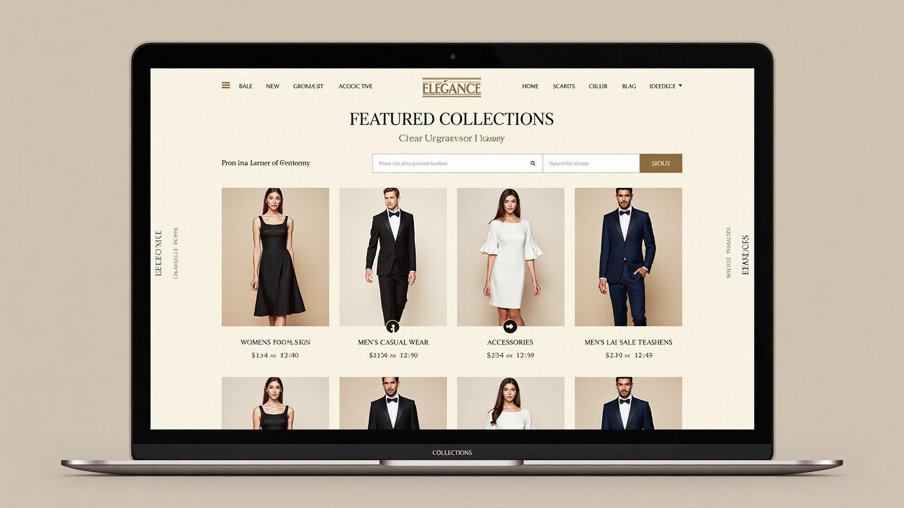

# Élégance - Luxury Fashion Website

![Élégance Fashion]

A sophisticated luxury fashion e-commerce website showcasing timeless elegance and modern minimalist design. Built as a portfolio project demonstrating modern web development skills and design principles.

## 📸 Screenshots

### Homepage - Hero Section

*Elegant hero section showcasing timeless luxury fashion with sophisticated branding and call-to-action elements*

### Collections Page

*Curated fashion collections displayed in a clean, organized grid layout with luxury aesthetics*

### Women's Section

*Dedicated women's fashion showcase with elegant models and sophisticated product presentation*

### About Page

*Brand heritage story with professional team portraits and company history in luxury setting*

## 🌟 Features

- **Responsive Design**: Fully responsive across all devices with mobile-first approach
- **Modern UI/UX**: Clean, minimalist design with luxury aesthetics
- **Performance Optimized**: Fast loading with lazy loading and optimized images
- **SEO Friendly**: Proper meta tags, semantic HTML, and structured data
- **Smooth Animations**: Subtle animations and transitions for enhanced user experience
- **Type Safety**: Built with TypeScript for robust development

## 📱 Pages & Sections

- **Homepage**: Hero section, featured collections, and newsletter signup
- **Collections**: Curated fashion collections with detailed presentations
- **Women's Section**: Dedicated women's fashion showcase
- **Men's Section**: Comprehensive men's fashion collections
- **About Page**: Brand story, heritage, and team information
- **404 Page**: Custom not found page with elegant design

## 🛠️ Tech Stack

- **Frontend Framework**: React 18 with TypeScript
- **Build Tool**: Vite for fast development and optimized builds
- **Styling**: Tailwind CSS with custom design tokens
- **UI Components**: shadcn/ui component library
- **Routing**: React Router v6 for client-side navigation
- **State Management**: TanStack Query for server state
- **Icons**: Lucide React for consistent iconography
- **Animations**: Tailwind CSS animations with custom transitions

## 🎨 Design System

- **Color Palette**: Luxury cream, bronze, and gold tones
- **Typography**: Modern, clean fonts with proper hierarchy
- **Components**: Reusable UI components with variants
- **Responsive**: Mobile-first approach with breakpoint consistency
- **Accessibility**: WCAG compliant design patterns

## 🚀 Getting Started

### Prerequisites

- Node.js (v18 or higher)
- npm or yarn package manager

### Installation

1. **Clone the repository**
   ```bash
   git clone <repository-url>
   cd elegance-fashion
   ```

2. **Install dependencies**
   ```bash
   npm install
   ```

3. **Start development server**
   ```bash
   npm run dev
   ```

4. **Open your browser**
   Navigate to `http://localhost:8080`

### Build for Production

```bash
npm run build
```

### Preview Production Build

```bash
npm run preview
```

## 📁 Project Structure

```
src/
├── components/          # Reusable UI components
│   ├── ui/             # shadcn/ui components
│   ├── Header.tsx      # Main navigation
│   ├── Footer.tsx      # Site footer
│   └── ...
├── pages/              # Page components
├── assets/             # Images and static assets
├── hooks/              # Custom React hooks
├── lib/                # Utility functions
└── styles/             # Global styles and config
```

<!-- ## 🌐 Live Demo

**Production URL**: [View Live Site](your link) -->

<!-- ## 📧 Contact

For questions about this project or collaboration opportunities:

- **Portfolio**: [Your Portfolio URL]
- **LinkedIn**: [Your LinkedIn Profile]
- **Email**: [Your Email]

## 📄 License

This project is created as a portfolio demonstration. All rights reserved. -->

---

Built with ❤️ using modern web technologies
